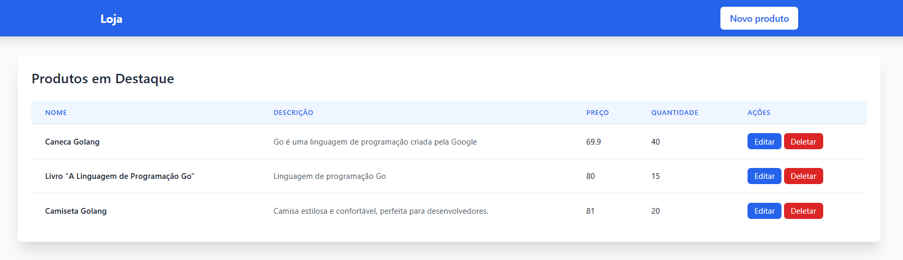
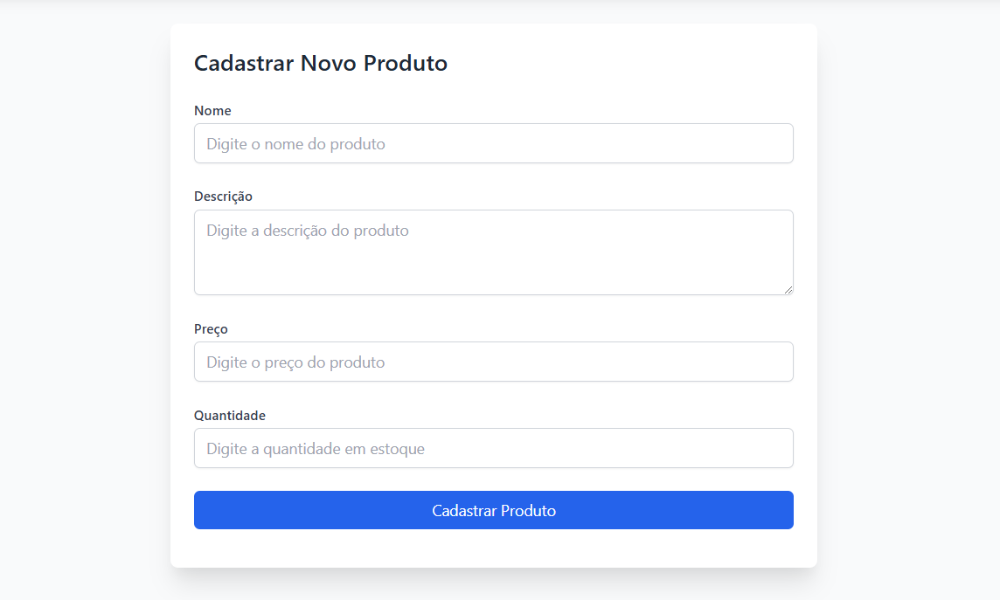

# Go Web App

This is a simple web application built with Go. It allows you to manage products, including creating, editing, and deleting them.

## Features

- List products
- Create new products
- Edit existing products
- Delete products

## Screenshots

### Home Page


### Create Product Page


## Getting Started

### Prerequisites

- Go 1.24.0 or later
- Docker

### Installation

1. Clone the repository:
    ```sh
    git clone https://github.com/yourusername/go-web-app.git
    cd go-web-app
    ```

2. Start the PostgreSQL database using Docker:
    ```sh
    docker-compose up -d
    ```

3. Run the application:
    ```sh
    go run main.go
    ```

4. Open your browser and go to .

## License

This project is licensed under the MIT License.